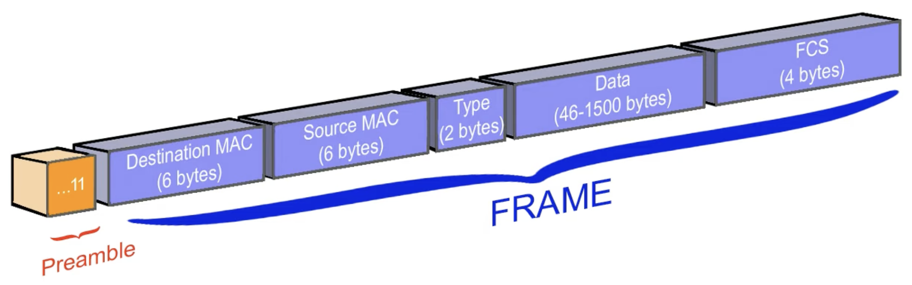
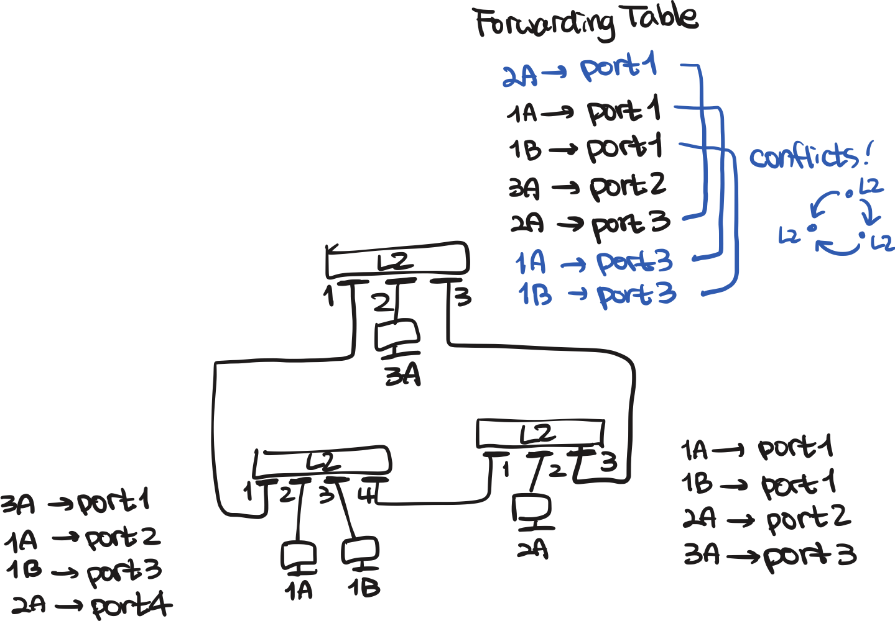
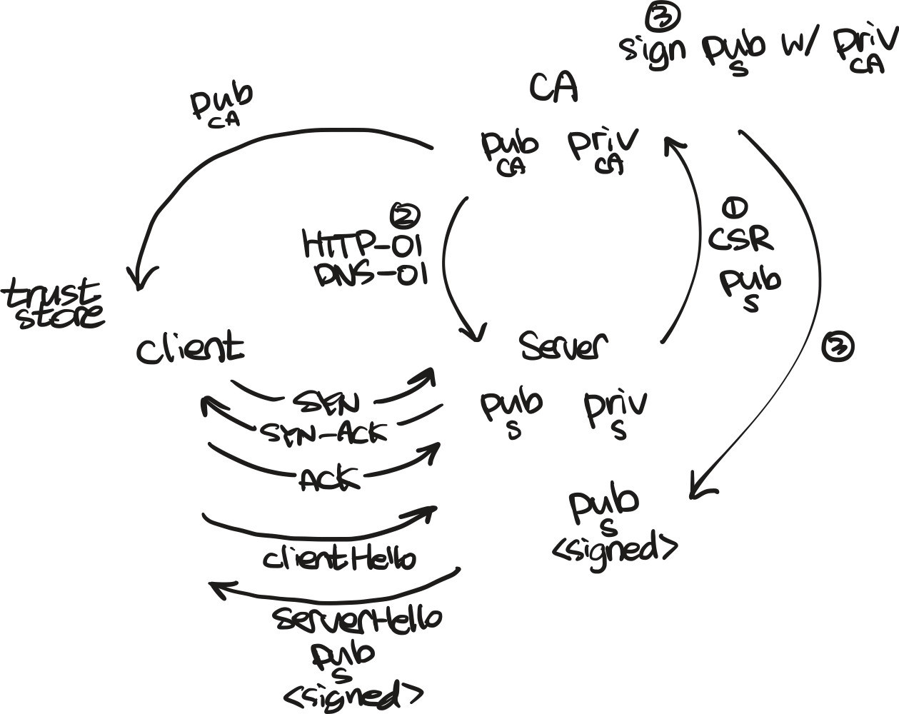

Internet has revolutionized the way we communicate. **In the year 1969, the ARPANET** was created as a project funded by the U.S. Department of Defense to connect computers at various universities and research institutions.

When we talk about TCP/IP, we often start with a diagram called the OSI 7 layer model. Let's first take a look at the OSI model and some mnemonics to remember the layers and then we will compare with the TCP/IP model. There is a detailed **blog post from Cloudflare about the OSI model** [here](https://www.cloudflare.com/learning/ddos/glossary/open-systems-interconnection-model-osi/).

{width=300}

The mnemonics to remember the OSI layers are:

> **P**lease **D**o **N**ot **T**hrow **S**ausage **P**izza **A**way

### Physical Layer

Think of a cable sending **electrical signals using bits**. The physical layer is responsible only for delivering raw bits over the medium — error detection (parity bits, CRC/FCS) is the job of higher layers, starting from the data link layer.

### Data Link Layer

This layer is the first layer that deals with source and destination addresses.
The switch operates at this layer, and it uses the **MAC address** to forward data (**frames**; on Ethernet, the payload is typically 46 ~ 1500 bytes) to the correct destination. Take a look at the video from Ace Networker [here](https://youtu.be/JsYqqDqmQaE?si=nRT_zVF86KMlfSj_) for more.

{width=500}

:::{.callout-note}
# MAC Address
A MAC address looks like this: `00:1A:2B:3C:4D:5E`. Each pair of hexadecimal digits represents 8 bits (a byte), and the entire MAC address is **48 bits (6 bytes) long**. The first half represent the **Organizationally Unique Identifier (OUI)**, which identifies the manufacturer of the network device. The remaining 24 bits are assigned by the manufacturer and are unique to each device.
:::

L2 switches in this layer have a **CAM (Content Addressable Memory)** table
that maps MAC addresses to physical ports.
When a frame arrives at the switch, it looks at the destination MAC address and forwards the frame to the appropriate port based on the CAM table.
If the destination MAC address is not in the CAM table, the switch will broadcast the frame to all ports except the one it arrived on.

{width=500}

When network topology is cyclic, there are infinitely many paths to the destination.
This will cause broadcast storms, where frames are continuously broadcasted.
To prevent this, we use the **Spanning Tree Protocol (STP)** to elect a root switch and block redundant paths, ensuring a loop-free topology.


### Network Layer

In this layer, **IP addresses** are used to route packets across different networks.
This is responsible for **routing packets between different networks**.
Problem with L2 switch is that this does not scale well because of the flat topology.
In contrast, **IP addresses can have a hierarchical structure**.
Just by looking at the IP address, we can determine if the destination is on the same network or a different network.

The IPv4 protocol was first defined in 1981 with [RFC 791](https://datatracker.ietf.org/doc/html/rfc791). We can see that the institution DARPA (successor name for ARPA) is listed as the author.

Encapsulation flows from higher layers down to lower layers.
An application layer **message** is wrapped into a transport layer **segment**;
the segment becomes the payload of a network layer **packet**;
and the packet in turn becomes the payload of a data link layer **frame**, which is what finally goes out on the wire.

{width=500}

From [RFC 791, section 3.1](https://datatracker.ietf.org/doc/html/rfc791#section-3.1),
the header of an IPv4 packet is **20 bytes long** (4 bytes \times 5 rows, excluding options) and contains the following fields:

```
 0                   1                   2                   3
 0 1 2 3 4 5 6 7 8 9 0 1 2 3 4 5 6 7 8 9 0 1 2 3 4 5 6 7 8 9 0 1
+-+-+-+-+-+-+-+-+-+-+-+-+-+-+-+-+-+-+-+-+-+-+-+-+-+-+-+-+-+-+-+-+
|Version|  IHL  |Type of Service|          Total Length         |
+-+-+-+-+-+-+-+-+-+-+-+-+-+-+-+-+-+-+-+-+-+-+-+-+-+-+-+-+-+-+-+-+
|         Identification        |Flags|      Fragment Offset    |
+-+-+-+-+-+-+-+-+-+-+-+-+-+-+-+-+-+-+-+-+-+-+-+-+-+-+-+-+-+-+-+-+
|  Time to Live |    Protocol   |         Header Checksum       |
+-+-+-+-+-+-+-+-+-+-+-+-+-+-+-+-+-+-+-+-+-+-+-+-+-+-+-+-+-+-+-+-+
|                       Source Address                          |
+-+-+-+-+-+-+-+-+-+-+-+-+-+-+-+-+-+-+-+-+-+-+-+-+-+-+-+-+-+-+-+-+
|                    Destination Address                        |
+-+-+-+-+-+-+-+-+-+-+-+-+-+-+-+-+-+-+-+-+-+-+-+-+-+-+-+-+-+-+-+-+
|                    Options                    |    Padding    |
+-+-+-+-+-+-+-+-+-+-+-+-+-+-+-+-+-+-+-+-+-+-+-+-+-+-+-+-+-+-+-+-+

                    Example Internet Datagram Header
```

The length of the header is determined by the IHL (Internet Header Length) field,
thus in 20 bytes header, the **IHL value is 5**. The maximum value of IHL is 15, which means the maximum header length is 60 bytes.

Thus packet body contains the actual data being transmitted, right after the header.
The length of the packet is determined by the **Total Length** field.

The maximum size of an IPv4 packet is theoretically 65,535 bytes ($2^{16} - 1$), but when we use ethernet,
the maximum frame data is 1500 bytes (the Ethernet MTU), which means the maximum body size in a packet is 1500 - 20 (header) = **1480 bytes**.

A packet without a body is also valid — the IP `Total Length` field can be as small as 20 (header only). The catch is that Ethernet requires a minimum frame payload of 46 bytes, so when an IP packet is shorter than that, the **Ethernet layer (L2) pads the frame with zeros up to 46 bytes** before transmission. The IP layer itself is not aware of this padding; the receiver uses the `Total Length` field to know where the real packet ends and the padding begins.

#### IP Classes

In the early days of the Internet, there was no distinction between public and private IP addresses.
Instead, IP addresses were allocated in a classful manner based on each organization's request
(check [RFC 790](https://datatracker.ietf.org/doc/html/rfc790) for more information).

| Class | Leading Bits | IP Range | Network Bits | Host Bits | Purpose |
|---|---|---|---|---|---|
| A | `0XXXXXXX` | 0.0.0.0 - 127.255.255.255 | 8 | 24 | Unicast (large networks) |
| B | `10XXXXXX` | 128.0.0.0 - 191.255.255.255 | 16 | 16 | Unicast (medium networks) |
| C | `110XXXXX` | 192.0.0.0 - 223.255.255.255 | 24 | 8 | Unicast (small networks) |
| D | `1110XXXX` | 224.0.0.0 - 239.255.255.255 | — | — | Multicast |
| E | `1111XXXX` | 240.0.0.0 - 255.255.255.255 | — | — | Reserved (experimental) |

This led to lots of wasted IP addresses, especially for small organizations that only needed a few IP addresses but were allocated a large block of addresses.

#### Classless IP Addressing with CIDR

**Classless Inter-Domain Routing (CIDR)** was introduced in 1993 with [RFC 1519](https://datatracker.ietf.org/doc/html/rfc1519).


CIDR replaces the fixed class boundaries (/8 for Class A, /16 for Class B, /24 for Class C) with arbitrary prefix lengths from /0 to /32, specified explicitly per network.

There is a whole course from [NetworkChuck](https://youtube.com/playlist?list=PLIhvC56v63IKrRHh3gvZZBAGvsvOhwrRF&si=x6X-y-Zp8EnpwiHj) about all this stuff.


#### Private IP Addresses

To further address the issue of IP address exhaustion, **private IP addresses** were introduced in 1996 with [RFC 1918, Section 3](https://datatracker.ietf.org/doc/html/rfc1918#section-3).

The private IP address ranges were allocated from each A, B, and C class as follows:

| Class | Private IP Range | CIDR Notation |
|---|---|---|
| A | 10.0.0.0 - 10.255.255.255 | 10.0.0.0/8 |
| B | 172.16.0.0 - 172.31.255.255 | 172.16.0.0/12 |
| C | 192.168.0.0 - 192.168.255.255 | 192.168.0.0/16 |

RFC 1918 designated these ranges as private, so they are not routed on the public Internet.


#### Network Address Translation (NAT)

**Network Address Translation (NAT)** was developed alongside the move toward private addressing — both came from the same need to ease IPv4 exhaustion. NAT was formalized first in [RFC 1631](https://datatracker.ietf.org/doc/html/rfc1631) (1994), and the private address ranges it translates from were standardized two years later in RFC 1918 (1996).

```
┌──────────────┐     ┌─────────────┐
│ 192.168.1.10 ├─────┤     NAT     ├────
└──────────────┘     └─────────────┘ 
```

### Transport Layer

This layer is responsible for end-to-end communication between applications running on different hosts.
Not only does it provide IP address translation, but it also provides lasting connections between applications using ports and protocols (TCP, UDP, etc.).

In TCP connections, the source and destination ports are 16-bit (up to 65535) numbers that identify the sending and receiving applications. The combination of source IP address, source port, destination IP address, and destination port is called a **socket**.

```
┌────────────────────┐     ┌────────────┐
│ 203.0.113.15:40121 ├─────┤ 1.1.1.1:80 │
└────────────────────┘     └────────────┘
```
Let's see some difference between TCP and UDP:

#### TCP and UDP

TCP is a connection-oriented protocol that provides reliable, ordered, and error-checked delivery of data between applications.
It establishes a connection between the sender and receiver before transmitting data and ensures that all packets are delivered in the correct order.
If any packets are lost or corrupted during transmission, TCP will retransmit them until they are successfully received.
The **three-way handshake** (SYN, SYN-ACK, ACK) is used to establish a TCP connection, which involves the following steps:

:::: {.columns}

::: {.column width="50%"}

```{mermaid}
sequenceDiagram
    participant Client
    participant Server
    rect rgb(230,230,250)
      Note over Client,Server: 3-Way Handshake
      Client->>Server: SYN
      Server->>Client: SYN-ACK
      Client->>Server: ACK
    end

    Client->>Server: Packet-N
    Server->>Client: ACK for Packet-N

    Server->>Client: Packet-M
    Client->>Server: ACK for Packet-M
```

:::

::: {.column width="50%"}

```{mermaid}
sequenceDiagram
    participant Client
    participant Server
    Note over Client,Server: UDP (no handshake, no ACK)
    Client->>Server: Packet-1
    Client-->>Server: Packet-2 (lost)
    Client->>Server: Packet-3
    Server->>Client: Reply-A
```

:::

::::

UDP just fires packets without a handshake or acknowledgments. If `Packet-2` is lost on the way, neither side notices at the transport layer — recovery (if any) is up to the application. This makes UDP a good fit for cases where **latency matters more than reliability**: DNS queries, real-time video/voice (RTP), online games, and QUIC (which builds reliability on top of UDP itself).

Let's see in the real world, how NAT works with TCP.

When a packet arrives at the NAT device, it looks at the source IP address and port number and translates them to a new IP address and port number before forwarding the packet to the destination. The NAT device also keeps a mapping table that tracks these translations so that when a response comes back from the destination, it can translate the destination IP address and port number back to the original source IP address and port number before forwarding it to the correct application.
 

```
┌──────────────┐ port 50000  ┌──────────────┐
│ 192.168.1.10 ├───┐         │              │
└──────────────┘   │         │    NAT GW    │
                   ├─────────┤ 203.0.113.15 ├── outbound
┌──────────────┐   │         │              │
│ 192.168.1.20 ├───┘         │              │
└──────────────┘ port 50001  └──────────────┘ 
                             ┌───────┴───────────────────┐
                             │       Mapping Table       │
                             │ 192.168.1.10:50000 :40121 │
                             │ 192.168.1.20:50001 :40122 │
                             └───────────────────────────┘
```

A typical EKS VPC follows a multi-tier subnet pattern — each AZ has 1 public subnet and 2 private subnets (check the [blog post](https://aws.amazon.com/blogs/containers/operating-resilient-workloads-on-amazon-eks) for more information):

- Public subnet: NLB and NAT Gateway
- Private subnet 1: EKS worker nodes
- Private subnet 2: DBs etc.

The difference between NLB and NAT Gateway is that NLB is used for inbound traffic, while **NAT Gateway is used for outbound traffic**.

### Session Layer

Let's say when you log into a website and you **change the network connection from WiFi to cellular data**, you don't want to log in again.
This is the job of the session layer, which manages sessions between applications. It allows applications to establish, maintain, and terminate sessions as needed.

Although the socket has changed (because the IP address and the port changes when switching networks), the session layer can maintain the session by using a unique session ID that is independent of the underlying network connection. We often use **cookies** to maintain sessions in web applications.

### Presentation Layer

The presentation layer is responsible for translating data between the application layer and the network.
**SSL/TLS** operates at this layer to provide encryption and secure communication between applications.
**GZIP** compression also operates at this layer to reduce the size of data being transmitted over the network.

There is a dedicated post about [TLS](./TLS.qmd).
Long story short, TLS is based on TCP connections, thus it starts with the three-way handshake to establish a TCP connection
(which is a L4 connection), and then it performs the TLS handshake.

In cryptography, asymmetric key pairs are commonly used, but each protocol (such as TLS or SSH) uses them differently during the handshake and authentication process.
One thing that does not change is that private key is not shared though the network (unless it is encrypted and sent as part of the handshake).

{width=300}

The default certificate format used in TLS is **X.509**, which is a standard format for public key certificates.
In Kubernetes, TLS certificates are often stored in **Secrets** and mounted as files in the container, which can then be used by applications to establish secure connections.
When first 6443 port is exposed, the TLS certificate is generated and stored in a Secret called `

### Application Layer

The application layer is the topmost layer of the OSI model and is responsible for providing network services directly to end-users and applications. It includes protocols that enable various types of communication and data exchange over the network. Some of the most common application layer protocols include HTTP, HTTPS, FTP, SMTP, DNS, and many others.

::: {style="max-width: 400px; margin: auto;"}
```{mermaid}

sequenceDiagram
    participant Client
    participant Server
    Client->>Server: TCP Handshake (L4)
    Client->>Server: TLS Handshake (L6)
    Client->>Server: HTTP Request (L7)
    Server->>Client: HTML/CSS/JS
```
:::
